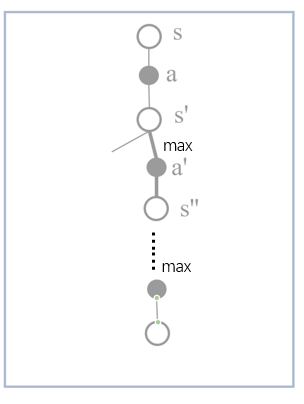

# Character 5

## 5.1

1. 因为该策略使用的是在自己点数小于20时一直要牌，所以20之前的数值不是终止状态，而只有当最终的点数恰好为20或者21的时候，赢的概率才非常大，其他情况输的概率较大，所以价值函数才会在20和21的地方变得很大。
2. 当庄家手里有A时，他可以当作11或者1，此时胜率会高一些，相应玩家的期望的回报就会少一些，其他的牌都比11小而且都是固定值，所以没有这种效果。
3. 也是A牌的效果。玩家手里有A时，可以灵活变化1或者11，胜率更大。

## 5.2

结果都一样，因为二十一点里边，在同一局没有相同的状态。

## 5.3

|  |
| :------------------------------: |
|               5.3                |

## 5.4

$$
\begin{aligned}
    Q_{n+1}&=\frac{1}{n+1}\sum_{i=1}^n R_i \\
    & =\frac{1}{n+1}(R_{n+1}+\sum_{i=1}^{n} R_i) \\
    & = \frac{1}{n+1}(R_{n+1}+nQ_n) \\
    & = \frac{1}{n+1}(R_{n+1}+(n+1)Q_n-Q_n) \\
    & = Q_n+\frac{1}{n+1}(R_{n+1}-Q_n) \\
\end{aligned}
$$

因此可得，为代码中的更新公式可以改为：

$$
\begin{aligned}
    Q(S_t,A_t) \leftarrow Q(S_t,A_t)+\frac{1}{n+1}(G-Q(S_t,A_t))
\end{aligned}
$$

## 5.5

由题意可知，每一次状态转移的奖励都是1，则$\rho_{1:10}=10$，此时on-policy和off-policy的奖励值一样。
此时如果使用首次访问MC方法，$v_s=10$；
每次访问MC方法，$v_s=\frac{1}{10}(1+2+3+4+5+6+7+8+9+10)=5.5$

## 5.6

$$
V(s) \doteq \frac{\sum_{t\in \mathcal{T}(s)} \rho_{t:T(t)-1}G_t}{\sum_{t\in \mathcal{T}(s)} \rho_{t:T(t)-1}}
$$

$$
Q(s,a) \doteq \frac{\sum_{t\in \mathcal{T}(s,a)} \rho_{t+1:T(t)-1}G_t}{\sum_{t\in \mathcal{T}(s,a)} \rho_{t+1:T(t)-1}}
$$

## 5.7

因为在一开始采样数量少的时候，相对于$G_t$分母太小，只有当采样数量足够大的时候，才能抵消掉其影响；
另外，采样开始时，偏差较大，随着采样episode的增多，偏差在减小。

## 5.8

在首次访问MC中，回报期望为$\mathbb{E}_b\left[\left(\Pi_{t=0}^{T-1}\frac{\pi(A_t|S_t)}{b(A_t|S_t)}G_0 \right)^2\right]$;
在每次访问MC中，回报的期望为$\mathbb{E}_b\left[\left(\frac{1}{T-1}\sum_{k=1}^{T-1}\Pi_{t=0}^{k}\frac{\pi(A_t|S_t)}{b(A_t|S_t)}G_0 \right)^2\right]=\infty$;
在每次访问MC中，如果使用加权重要性采样，则回报的期望值为$\mathbb{E}_b\left[\left(\frac{1}{|J(s)|}\sum_{k=1}^{T-1}\Pi_{t=0}^{k}\frac{\pi(A_t|S_t)}{b(A_t|S_t)}G_0 \right)^2\right]\le 1$。

## 5.9

$$
\begin{aligned}
&N \leftarrow N+1 \\
&V(S_t)  \leftarrow V(S_t)+\frac{1}{N}(G-V(S_t))
\end{aligned}
$$

## 5.10

$$
\begin{aligned}
    V_{n+1} &= \frac{\sum_{k=1}^{n}W_kG_k}{\sum_{k=1}^{n}W_k} \\
    & = \frac{\sum_{k=1}^{n-1}W_kG_k + W_nG_n}{C_n} \\
    & = \frac{(\sum_{k=1}^{n-1}W_kG_k)(\sum_{k=1}^{n-1}W_k)}{C_n(\sum_{k=1}^{n-1}W_k)} +\frac{W_n}{C_n}G_n \\
    & = \frac{\sum_{k=1}^{n-1}W_k}{C_n}V_n +\frac{W_n}{C_n}G_n \\
    & = V_n - \frac{W_n}{C_n}V_n +\frac{W_n}{C_n}G_n \\
    & = V_n + \frac{W_n}{C_n}(G_n-V_n) \\
\end{aligned}
$$

## 5.11

因为在算法中，$A_t \ne \pi(S_t)$跳出了当前内循环，所以可以保证了当前选择的$A_t = \pi(S_t)$，所以可以说$\pi(A_t|S_t)=1$

## 5.12

见code部分。

## 5.13

## 5.14

## 5.15

