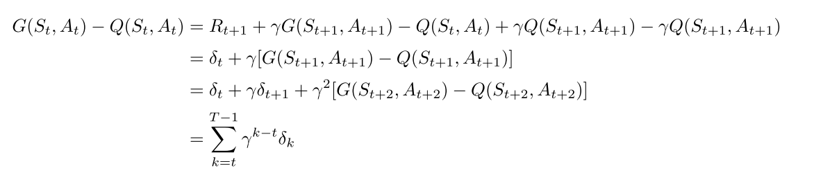
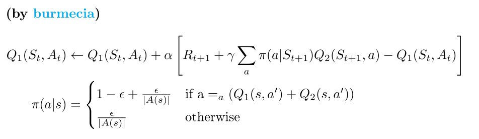

# Character 6

## 6.1

由$V_{t+1}(S_t) \leftarrow V_t(S_t)+\alpha [R_{t+1} +\gamma V_t(S_{t+1})-V_t(S_t)]$，

$\delta_t = R_{t+1}+\gamma V_t(S_{t+1})-V_t(S_t)$

令$\mu_{t}=\alpha [R_{t+1} +\gamma V_t(S_{t+1})-V_t(S_{t})]$

得，

$$
\begin{aligned}
    G_t-V_t(S_t) &= R_{t+1} + \gamma G_{t+1} - V_t(S_t) + \gamma V_t(S_{t+1}) - \gamma V_t(S_{t+1}) \\
    & = \delta_t + \gamma(G_{t+1}-V_t(S_{t+1})) \\
    & = \delta_t + \gamma(G_{t+1}-V_{t}(S_{t+1}) + \mu_{t+1}) -\gamma\mu_{t+1} \\
    & = \delta_t + \gamma(G_{t+1}-V_{t+1}(S_{t+1})) - \gamma \mu_{t+1} \\
    & = \delta_t +\gamma\delta_{t+1} + \gamma^2(G_{t+2}-V_{t+2}(S_{t+2})) + \gamma \mu_{t+1} +\gamma^2 \mu_{t+2}\\
    & ... \\
    & = \sum_{k=t}^{T-1}\left[\gamma^{k-t}\delta_{k} + \gamma^{k-t+1}\mu_{k+1} \right]
\end{aligned}
$$

由上，需要额外加的一项是$\sum_{k=t}^{T-1} \gamma^{k-t+1}\mu_{k+1}$

## 6.2

## 6.3

只有$V(A)$发生变化，说明该幕在A点结束。因为$\gamma=1,reward=0$，并且状态值都被初始化为0.5，所以其他的点不会变（只有A和E在第一幕的时候会变化）。
对于A点来说，改变量$0.5*(-\alpha)=-0.05$。

## 6.4

$\alpha$的至于变化不会影响对哪种算法更好的判断，因为$\alpha$足够小是TD和MC算法收敛的要求，从图上来看，算法的误差都在变得很小，满足了收敛性的要求。在长期来看，不会影响最终的最小的那个MSE的值。

所以，也不存在一个固定的alpha，使得表现比图中的更好。但是像上文中提到的，使用变化的alpha或者权重，可能会有效果。

## 6.5

TD误差曲线先下降后上升是因为alpha不够小。另外，近似函数的初始化也会有影响，将所有的状态价值初始化为同样的值，可能造成对终止状态价值函数的高估。
（参见相关章节 [https://github.com/LyWangPX/Reinforcement-Learning-2nd-Edition-by-Sutton-Exercise-Solutions](https://github.com/LyWangPX/Reinforcement-Learning-2nd-Edition-by-Sutton-Exercise-Solutions)）

## 6.6

1. DP方法
2. 数值化方法。
以E点为例，向右到达终止状态的概率为

$$
\begin{aligned}
    P_E(R)&=1-P_E(L) \\
    & = 1-P_E(D)*P_D(L) \\
    & = 1-P_E(D)*[P_D(C)*P_C(L)+P_D(E)*P_E(L)] \\
\end{aligned}
$$

因为$P_C(L)=0.5,P_D(C)=0.5,P_E(D)=0.5$，

所以$P_E(R)=1-0.5*[0.5*0.5+0.5*P_E(L)]$

所以$P_E(L)=0.5*[0.5*0.5+0.5*P_E(L)]$

可得，$P_E(L)=\frac{1}{6}$，
其他的同理可得。

## 6.7

## 6.8

|     证明方法与公式(6.6)类似      |
| :------------------------------: |
|  |

## 6.9

查看code部分

## 6.10

查看code部分

## 6.11

Q-learning之所以称为off-policy学习，是因为他在执行动作的策略基于下一个状态及其贪婪动作（max Q），这在本质上使得选择动作的策略使用贪婪策略，和评估的策略不是同一个。它假设是，遵循贪婪策略（即使实际上没有遵循贪婪策略）可以得到状态-动作对的估计值。

而SARSA是on-policy学习的原因是，它在更新Q值时，使用的是下一个状态s'，和依据当前Q值选择的动作。它假设继续沿着当前策略可以得到状态-动作对的估计值。

The reason that Q-learning is off-policy is that it updates its Q-values using the Q-value of the next state s and the greedy action a. In other words, it estimates the return (total discounted future reward) for state-action pairs assuming a greedy policy were followed despite the fact that it’s not following a greedy policy. The reason that SARSA is on-policy is that it updates its Q-values using the Qvalue of the next state s and the current policy’s action a. It estimates the return for state-action pairs assuming the current policy continues to be followed.

## 6.12

当使用贪心方式选择动作时，在一般情况下Q-learning和SARSA相同，但是偶尔在$S=S'$的情况时，会有不同的结果。

此时，SARSA会使用和上次循环一样的动作$A'$，但是Q-learning在Q函数更新后，$max_a Q(S',a)$可能会有所不同。

## 6.13

|  |
| :------------------------------: |
|             更新公式             |

## 6.14

只考虑每天早晨停车位的后位状态，这将是昨天行动的全部结果。 

这将减少计算量，因为我们有很多不同的汽车编排方式，但是第二天早上我们将在每个位置汽车数量相同。