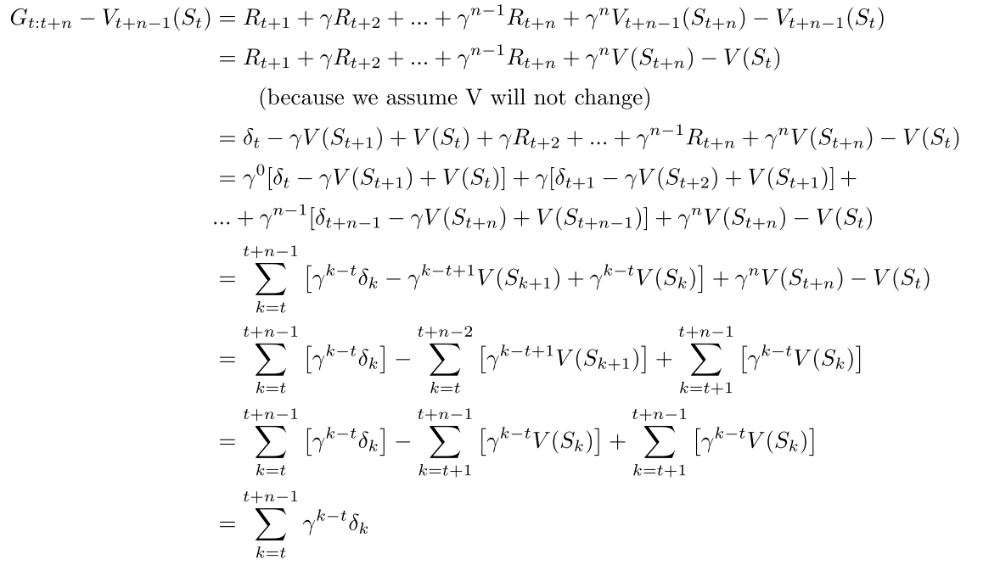
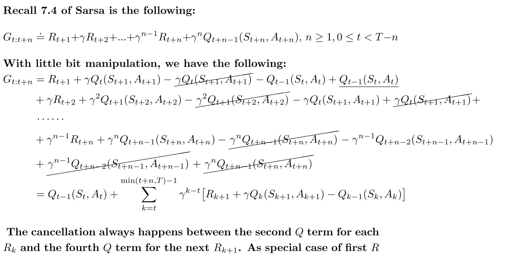
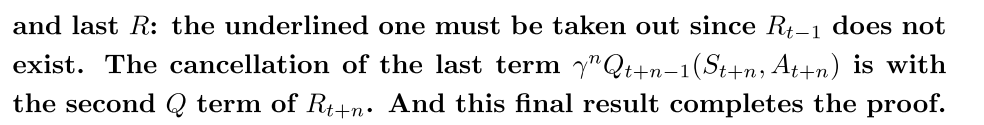
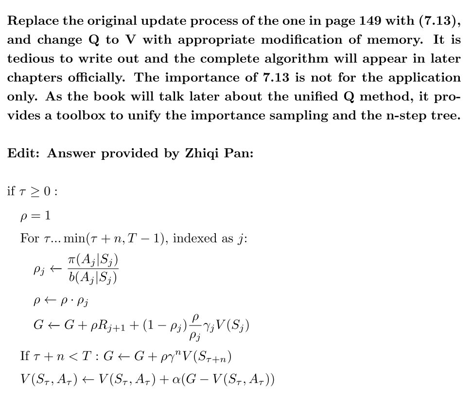

# Character 7

## 7.1

由（6.6），$\delta_t = R_{t+1}+\gamma V(S_{t+1})-V(S_t)$

这里，$V_{t+n}(S_t) \leftarrow V_{t+n-1}(S_t)+\alpha [G_{t:t+n}-V_{t+n-1}(S_t)]$，

此处误差使用，$G_{t:t+n}-V_{t+n-1}(S_t)$

因为假设V是不变的，所以

## 7.2

见code部分

## 7.3

使用19个状态的随机游走任务，是为了防止任务过早结束。如果状态数太少，那么很有可能在小于n的步骤内结束，之后的G都不变，这样对比不准确。

## 7.4

[https://github.com/LyWangPX/Reinforcement-Learning-2nd-Edition-by-Sutton-Exercise-Solutions](https://github.com/LyWangPX/Reinforcement-Learning-2nd-Edition-by-Sutton-Exercise-Solutions)

## 7.5

[https://github.com/LyWangPX/Reinforcement-Learning-2nd-Edition-by-Sutton-Exercise-Solutions](https://github.com/LyWangPX/Reinforcement-Learning-2nd-Edition-by-Sutton-Exercise-Solutions)

## 7.7-7.11

[https://github.com/LyWangPX/Reinforcement-Learning-2nd-Edition-by-Sutton-Exercise-Solutions](https://github.com/LyWangPX/Reinforcement-Learning-2nd-Edition-by-Sutton-Exercise-Solutions)

